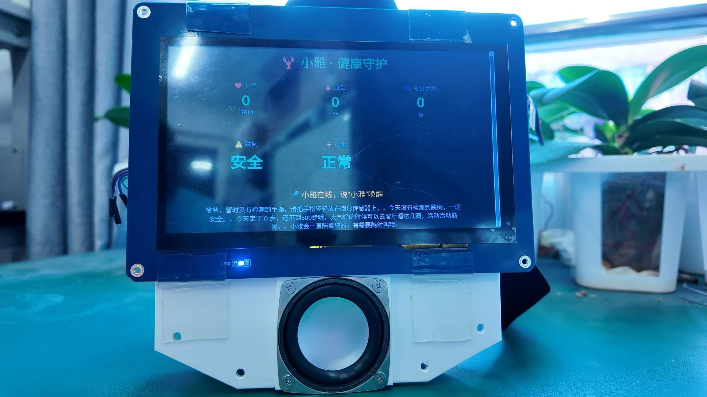
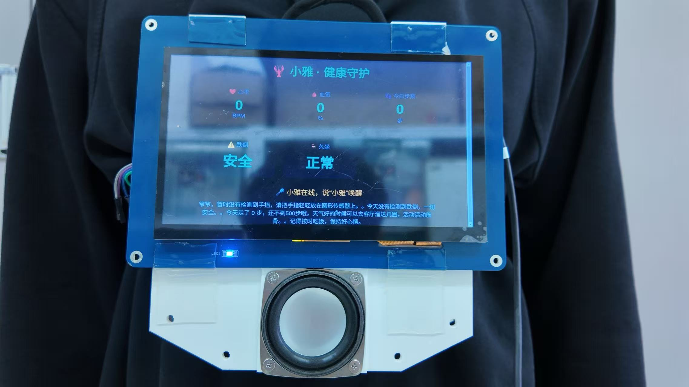
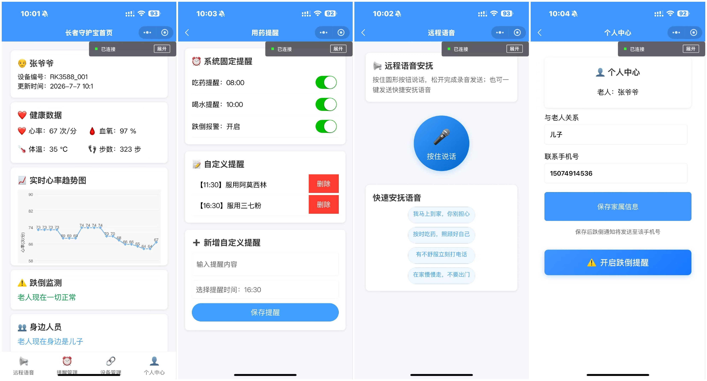

# 基于 RK3588 的老人记忆增强认知辅助系统

<div align="center">


基于 RK3588、OpenClaw、FunASR、YOLOv8、YuNet、SFace 的多模态智慧养老系统

</div>

---

# 项目简介

本项目面向阿尔茨海默症及认知障碍老人，基于 RK3588 边缘 AI 平台设计了一套集：

- 👤 人脸识别
- 📦 物品识别
- 🎤 离线语音交互
- ❤️ 心率、血氧、体温监测
- 🚶 跌倒检测
- ☁ 华为云 IoT
- 📱 微信小程序
- 🤖 OpenClaw Agent

于一体的老人认知辅助系统。

系统采用 OpenClaw + MCP 作为智能调度中心，将视觉模型、语音模型、传感器统一封装为工具，实现自然语言控制整个系统。

---

# 功能

## 人脸识别

位于

```
people2/
```

采用

- YuNet
- SFace

支持

- 家属识别
- 陌生人识别
- 人脸注册
- 本地特征库

主要程序：

```
register_face.py
recognize_face.py
collect_face.py
```

---

## 物品识别

采用

YOLOv8 RKNN

主要程序：

```
app/rknn_inference.py

people2/main_camera_fps_v8.py
```

模型：

```
best.rknn
```

---

## 语音交互

采用：

- FunASR
- WebRTC VAD

主要程序：

```
voice_recorder2.py

voice_test.py

asr_main3.py
```

支持：

- 唤醒词
- 离线语音识别
- 自然语言问答

---

## OpenClaw Agent

主要程序：

```
app/elder_mcp_server.py

project/modules/openclaw_client.py
```

支持：

- MCP Tool
- Agent 调度
- 自然语言控制

例如：

```
这是谁？

这是什么？

我的心率是多少？

今天走了多少步？
```

---

## 健康监测

主要程序：

```
health_monitor.py

heart_thread.py

mpu6050.py

as6221.py
```

支持：

- 心率

- 血氧

- 体温

- 跌倒检测

---

## TTS

主要程序：

```
tts_service.py

tts_test.py
```

采用讯飞 XFS5152CE 模块完成语音播报。

---

## 华为云 IoT

主要程序：

```
huaweiyun.py
```

支持 MQTT 上传：

- 心率

- 血氧

- 体温

- 跌倒状态

---

## 微信小程序

源码：

```
前鳃小程序 3.0/
```

支持：

- 健康数据

- 心率曲线

- GPS

- 跌倒提醒

- AI建议

- 远程语音安抚

---

# 工程结构

```
.

├── app
│   ├── camera_capture.py
│   ├── dashboard_app.py
│   ├── elder_brain_api.py
│   ├── elder_mcp_server.py
│   ├── face_recognizer.py
│   ├── health_monitor.py
│   ├── i2c_base.py
│   ├── rknn_inference.py
│   └── tts_service.py
│
├── people2
│   ├── register_face.py
│   ├── recognize_face.py
│   ├── collect_face.py
│   ├── models
│   └── func
│
├── project
│   └── modules
│       ├── asr_main3.py
│       ├── voice_recorder2.py
│       ├── voice_test.py
│       ├── openclaw_client.py
│       ├── huaweiyun.py
│       ├── heart_thread.py
│       ├── mpu6050.py
│       ├── as6221.py
│       └── tts_test.py
│
├── 前鳃小程序 3.0
│
├── best.rknn
│
└── README.md
```

---

# 软件架构

```
麦克风
      │
      ▼
FunASR
      │
      ▼
OpenClaw
      │
      ▼
MCP Server
      │
 ┌────┼───────────┐
 │    │           │
 ▼    ▼           ▼
人脸  物品      健康监测
 │    │           │
 ▼    ▼           ▼
TTS  华为云    微信小程序
```

---

# AI 模型

| 模型 | 用途 |
|------|------|
| FunASR | 离线语音识别 |
| YuNet | 人脸检测 |
| SFace | 人脸识别 |
| YOLOv8 RKNN | 物品识别 |
| OpenClaw | Agent |

---

# 硬件

- RK3588
- USB Camera
- USB Microphone
- MAX30102
- MPU6050
- AS6221
- XFS5152CE

---

# 运行

启动 FastAPI：

```bash
python app/elder_brain_api.py
```

启动 MCP：

```bash
python app/elder_mcp_server.py
```

启动健康监测：

```bash
python app/health_monitor.py
```

启动语音助手：

```bash
python project/modules/asr_main3.py
```

---

# 📷 项目展示

## 🏗 系统架构



---

## 📸 实物展示



---

## 📱 微信小程序



---

## 🎥 演示


---

# 开发环境

Ubuntu 22.04

Python 3.10

OpenCV

RKNN Toolkit Lite2

OpenClaw

FastAPI

FunASR

PyAudio

---

# License

MIT License